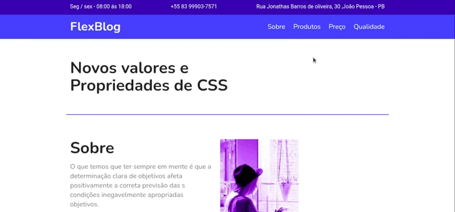

<h1 align="center"> 
 Flex Blog
</h1>

<p align="center">
	Esse projeto tem como objetivo a criação de uma página utilizando os conceitos do css flex-box
</p>

<p align="center">
  <a href="#-Tecnologias">Tecnologias</a>&nbsp;&nbsp;&nbsp;|&nbsp;&nbsp;&nbsp;
  <a href="#-Executando">Executando</a> 
</p>

## ✅ Apresentação:
<br/>
<p align="center">
  
</p>
<br/>

## 📱 Responsividade:
<br/>

<p align="center">
  
</p>

<br/>

## 🧪 Tecnologias


## 🚀 Executando

Clone o projeto e acesse a pasta dos arquivos

```bash
$ git clone https://github.com/lucasDechenier/css-flex-blog.git
```

Siga as etapas para instalação e execução

```bash
# Instalando as dependências
$ yarn install

# Iniciando o projeto
$ yarn serve
```
